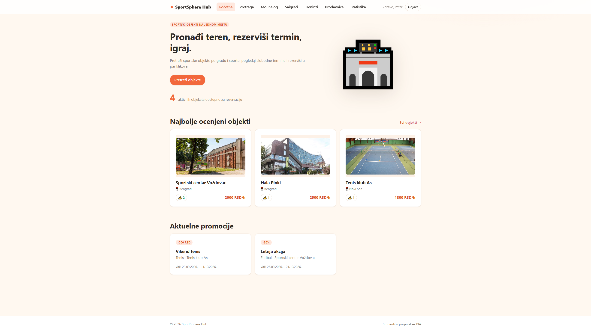
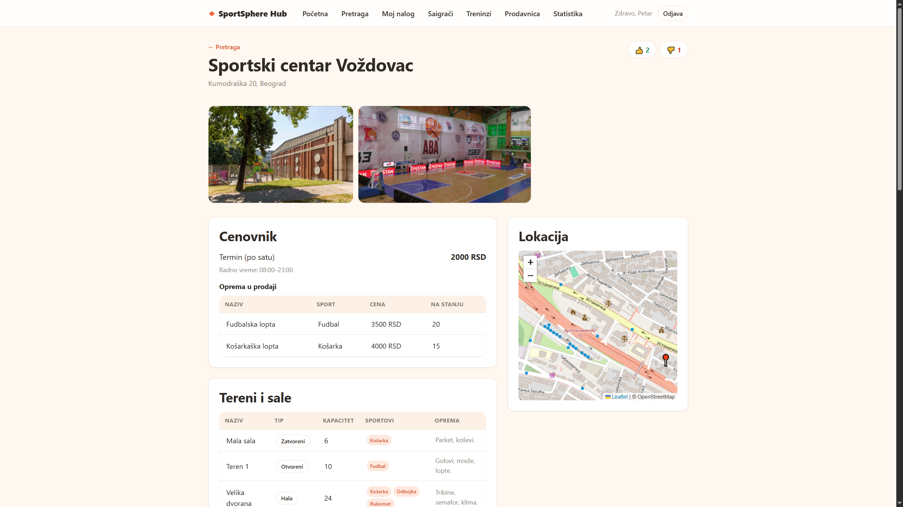
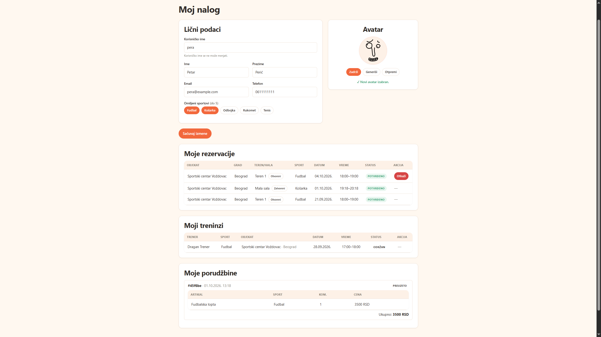
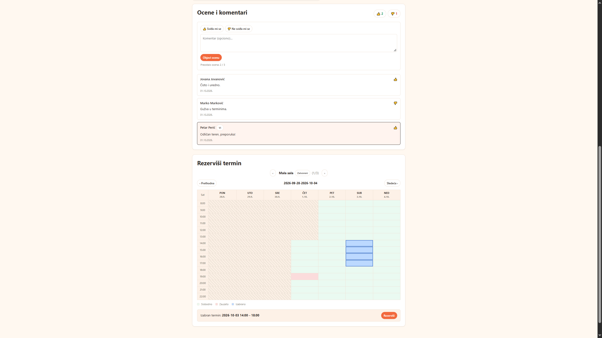
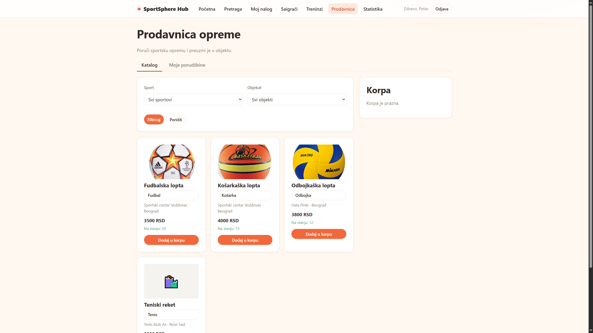
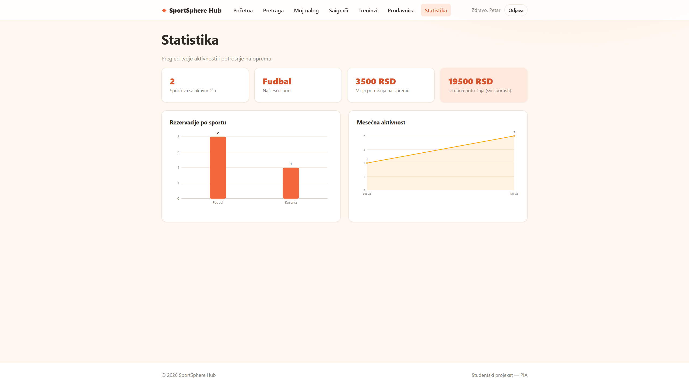
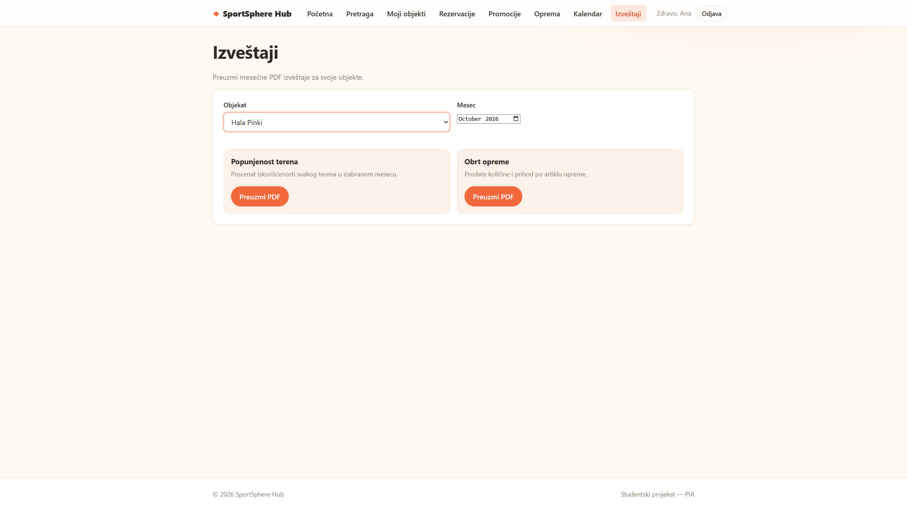
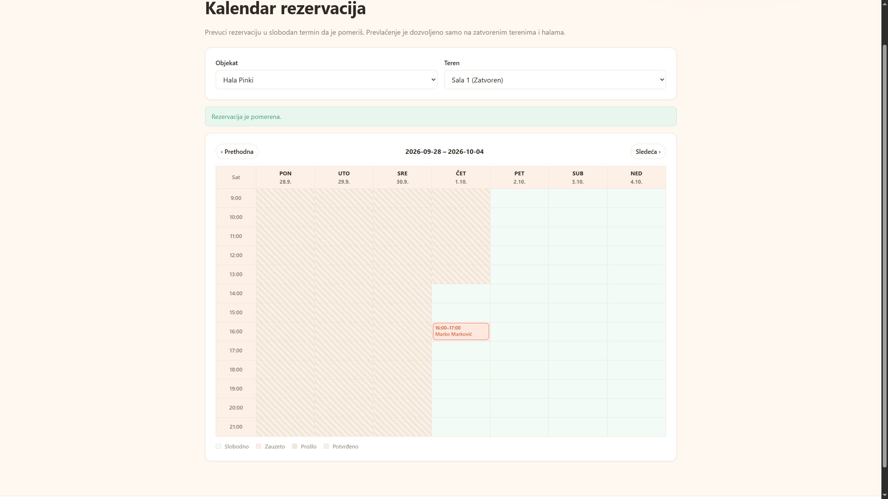
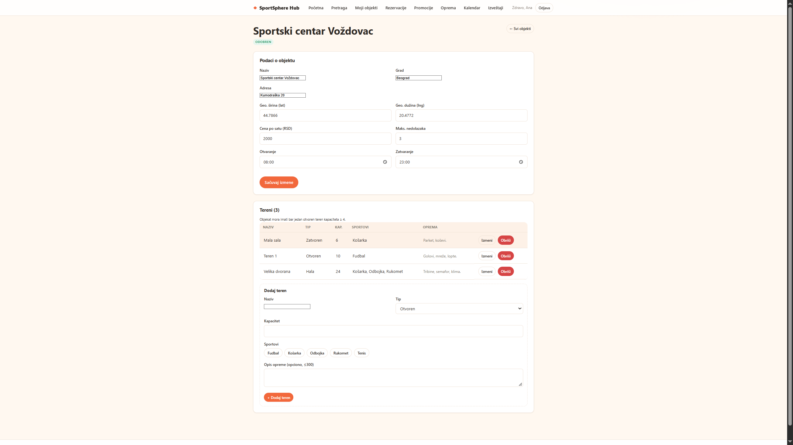
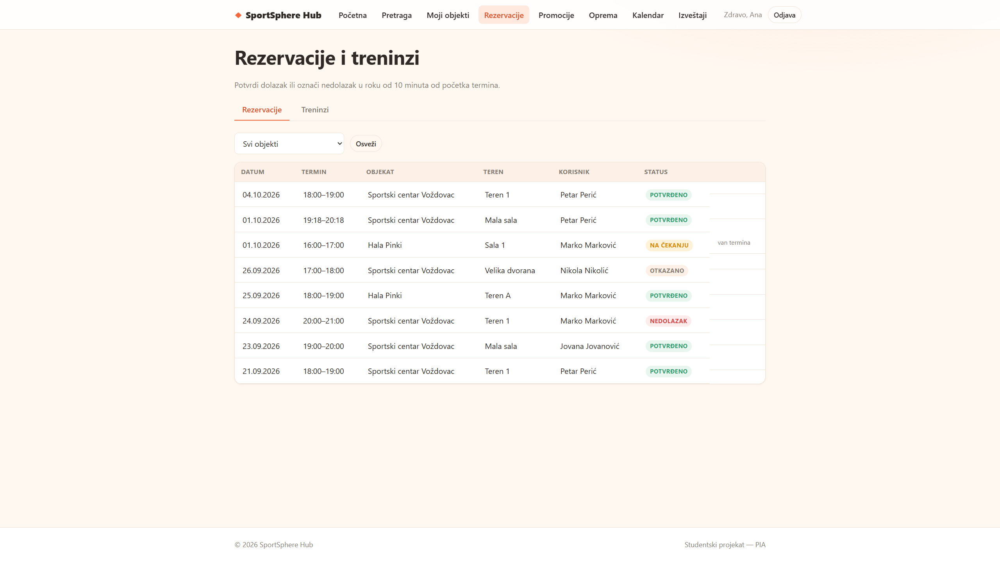

# ⚽ SportSphere Hub

SportSphere Hub is a full-stack web application for **sport center management**, developed as a **PIA project at ETF**.

The application provides a platform for users to explore sport centers, make reservations, interact through comments, view statistics, and use an integrated shop. It also provides dedicated functionality for workers and administrators, including reservation management, worker scheduling, statistics, and report generation.

The project consists of an **Angular frontend** and a **Node.js backend**.

---

## ✨ Features

### 👤 User

- User account management
- Browse sport centers
- View detailed sport center information
- View sport center locations
- Make reservations
- Leave comments
- View statistics
- Browse the shop

### 🏢 Sport Center Management

- Manage sport center information
- Manage workers
- Manage reservations
- Worker scheduling and calendar
- Reservation overview
- Statistics and data visualization
- Report generation

### 🛒 Shop

The application includes an integrated shop where users can browse available products.

### 📊 Statistics & Reports

SportSphere Hub provides statistical overviews and report generation functionality for managing and analyzing sport center data.

### 🗓️ Worker Management

Workers have dedicated functionality for managing their schedules and reservations, including:

- Worker calendar
- Reservation management
- Worker management

---

## 🛠️ Tech Stack

### Frontend


- Angular
- TypeScript
- HTML
- CSS
- Angular Router
- RxJS

### Backend


- Node.js
- Express
- TypeScript

### Database


- MongoDB
- Mongoose

### Other Technologies

- JWT authentication
- bcrypt
- Leaflet
- PDF generation
- REST API

A more detailed list of libraries used by the project can be found in [`LIBRARIES.txt`](LIBRARIES.txt).

---

## 🏗️ Project Structure

```text
SportSphereHub/
│
├── back/                    # Node.js backend
│
├── front/                   # Angular frontend
│
├── screenshots/             # Application screenshots
│   ├── Account.png
│   ├── CommentsAndReservation.png
│   ├── Home.png
│   ├── ReportGeneration.png
│   ├── Shop.png
│   ├── Stats.png
│   ├── View.png
│   ├── WorkerCalender.png
│   ├── WorkerMenagement.png
│   └── WorkerReservations.png
│
├── LIBRARIES.txt            # List of libraries used
└── .gitignore
```

---

## 🚀 Getting Started

### Prerequisites

Make sure you have the following installed:

- [Node.js](https://nodejs.org/)
- npm
- MongoDB
- Angular CLI

### Clone the repository

```bash
git clone https://github.com/kekec3/SportSphereHub.git
cd SportSphereHub
```

### Backend

Navigate to the backend directory and install its dependencies:

```bash
cd back
npm install
```

Start the backend:

```bash
npm start
```

### Frontend

Open another terminal and navigate to the frontend directory:

```bash
cd front
npm install
```

Start the Angular development server:

```bash
npm start
```

The application will normally be available at:

```text
http://localhost:4200
```

Make sure the backend and MongoDB are running before using the application.

---

# 📸 Screenshots

## 🏠 Home

The main page of SportSphere Hub, providing an overview of the application and access to its main functionality.



---

## 🏟️ Sport Center View

Detailed view of a sport center, including its information and available functionality.



---

## 👤 Account

User account and profile interface.



---

## 💬 Comments & Reservations

Interface combining sport center comments and reservation functionality.



---

## 🛒 Shop

The integrated shop interface for browsing available products.



---

## 📊 Statistics

Statistical information and data visualization.



---

## 📄 Report Generation

Interface for generating reports from application data.



---

## 📅 Worker Calendar

Calendar interface for worker scheduling and organization.



---

## 👷 Worker Management

Interface for managing workers within the sport center.



---

## 📋 Worker Reservations

Interface for viewing and managing sport center reservations from the worker side.



---

## 🔐 Authentication

The application uses authenticated access to separate user functionality from functionality intended for workers and management.

Authentication and authorization are handled through the backend.

---

## 🗺️ Maps

Sport center locations are presented using an interactive map, allowing users to view where individual sport centers are located.

---

## 📈 Reports & Statistics

SportSphere Hub provides tools for monitoring sport center activity through statistics and generating reports from application data.

---

## 📚 Libraries

A list of external libraries and technologies used throughout the project is available in:

[`LIBRARIES.txt`](LIBRARIES.txt)

---

## 🎓 Project

**SportSphere Hub** was developed as a **PIA project at ETF**.

The project demonstrates a full-stack web application architecture consisting of an Angular frontend, Node.js backend, and database layer, with functionality covering sport center management, reservations, workers, statistics, reports, comments, and an integrated shop.

---

Made by **[kekec3](https://github.com/kekec3)**
